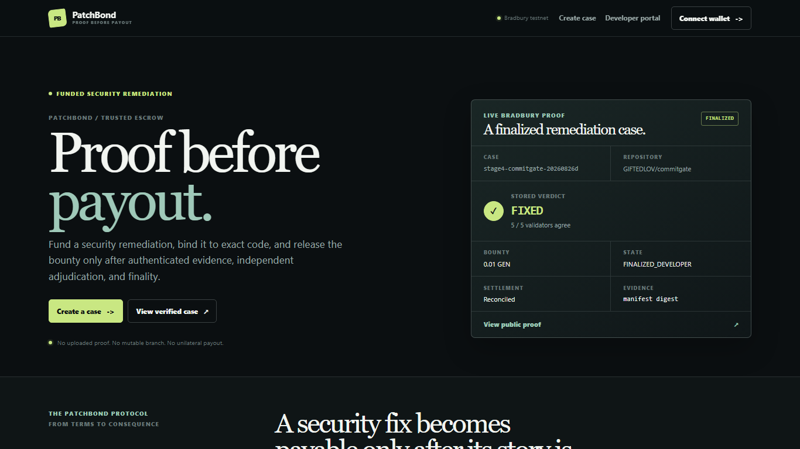
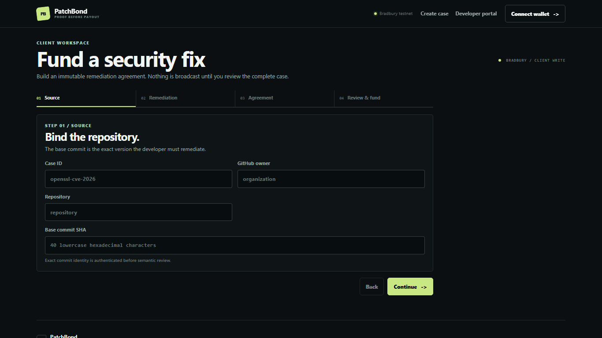
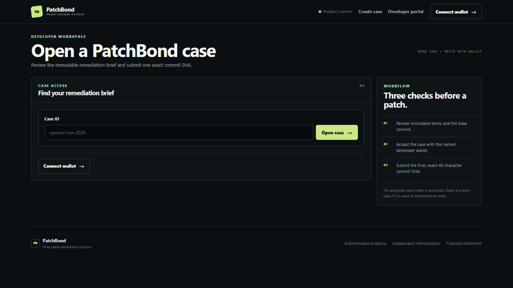
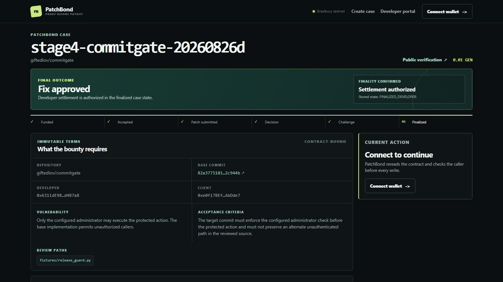
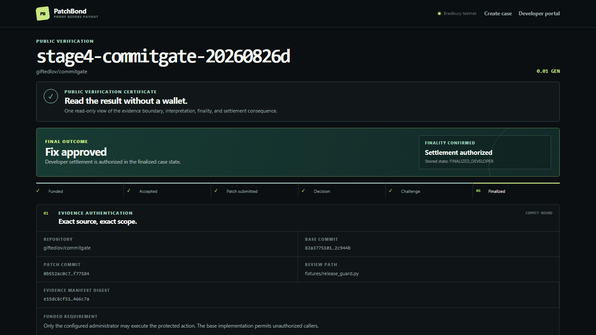

# PatchBond

**Proof before payout for security remediation.**

[](https://github.com/GIFTEDLOV/patchbond/actions/workflows/ci.yml)




> Bradbury testnet only. PatchBond is not a mainnet deployment.

## Live links

| Resource | Link |
| --- | --- |
| Application | [patchbond.vercel.app](https://patchbond.vercel.app) |
| Repository | [GIFTEDLOV/patchbond](https://github.com/GIFTEDLOV/patchbond) |
| Bradbury contract | `0x31fAeeb4C21fBDceeE2EF77BF75145ABC7931834` |
| Representative case | [`stage4-commitgate-20260826d`](https://patchbond.vercel.app/verify/stage4-commitgate-20260826d) |
| Public verification | [Open the verification certificate](https://patchbond.vercel.app/verify/stage4-commitgate-20260826d) |
| Final proof artifact | [`artifacts/final-release-proof.json`](artifacts/final-release-proof.json) |
| CI workflow | [Exact-head CI](https://github.com/GIFTEDLOV/patchbond/actions/workflows/ci.yml) |

## Product

PatchBond is funded security-remediation escrow. A client locks GEN against an
immutable vulnerability brief, a repository and base commit, a named developer,
and a bounded challenge window. The developer submits one exact patch commit.
The contract authenticates the code evidence, GenLayer validators independently
interpret whether the patch satisfies the requirement, and finality controls
what happens to the bounty.

PatchBond is built around one rule: **proof before payout**.

## Problem

A security-remediation bounty has a client, a developer, money, a vulnerable
base revision, an exact patch, natural-language acceptance criteria, and a real
disagreement risk. Normal smart contracts are good at hashes and state
transitions, but they cannot decide whether a bounded code change actually
satisfies a semantic security requirement.

That leaves a trust conflict. The client should not be able to reject a good
fix unilaterally, and the developer should not be able to choose arbitrary
evidence or self-certify the result. Operational failures must also remain
different from a business verdict.

## Why GenLayer

Deterministic contract logic authenticates exact repositories, commits, files,
bytes, hashes, terms, deadlines, and accounting. It cannot by itself answer a
bounded question such as whether a patch adds the required authorization check
without preserving an alternate unauthenticated path.

PatchBond uses GenLayer for that narrow semantic boundary:

- the client and developer do not run the deciding model;
- validators independently retrieve the repository and exact commits bound by
  the contract;
- each validator validates provenance and content integrity before semantic
  evaluation;
- each validator independently derives one of three outcomes:
  `FIXED`, `NOT_FIXED`, or `INCONCLUSIVE`;
- the contract owns the state consequence, challenge path, deadlines, and
  settlement accounting.

**Consensus proves agreement about interpretation; it does not authenticate
evidence.** Repository and commit provenance are verified before semantic
evaluation.

## How it works

1. **Fund.** The client creates a payable case with immutable terms: repository,
   base commit, vulnerability requirement, acceptance criteria, review paths,
   developer, bounty, and challenge duration.
2. **Accept.** The named developer accepts the case without changing its terms.
3. **Bind evidence.** The developer submits an exact patch commit. The contract
   constructs the GitHub evidence locations from the bound repository and
   commits.
4. **Authenticate.** Validators independently verify repository identity,
   commit identity and ancestry, target paths, file bytes, Git blob hashes, and
   the canonical evidence manifest digest.
5. **Adjudicate.** Validators independently interpret the authenticated evidence
   against the immutable requirement and return only the bounded verdict.
6. **Challenge.** `FIXED` is provisional. The client receives a guaranteed
   challenge window with repository-bound challenge evidence.
7. **Finalize.** After an uncontested expiry, a terminal challenge response, or
   a response timeout, the contract authorizes the exact deterministic
   consequence. External settlement is reconciled separately after finality.

### Product walkthrough









The application keeps technical identifiers and transaction details available,
but secondary. Everyday users see the current action and human-readable state
first.

## Architecture

```mermaid
flowchart TD
    P[Client / Developer] --> F[PatchBond frontend]
    F --> C[PatchBondEscrow intelligent contract]
    C --> A[Deterministic repository + commit authentication]
    A --> E[Bounded authenticated evidence]
    E --> V[Independent GenLayer semantic adjudication]
    V --> D{FIXED | NOT_FIXED | INCONCLUSIVE}
    D --> CH[Challenge / response when applicable]
    CH --> FIN[Finality]
    FIN --> S[Deterministic settlement consequence]
    T[Trust boundary: frontend never decides verdicts or payout] -.-> F
    T -.-> C
```

The frontend is a read/write client. It has no verdict, payout, refund, or
entitlement authority. The contract is the security authority for roles,
terms, evidence admissibility, transitions, deadlines, and settlement.

## Use

The public application is at [patchbond.vercel.app](https://patchbond.vercel.app).
The client can create a case from [Create case](https://patchbond.vercel.app/cases/new).
A developer can open a known case from the [Developer portal](https://patchbond.vercel.app/developer).
Anyone can read a case certificate without a wallet from [Public verification](https://patchbond.vercel.app/verify/stage4-commitgate-20260826d).

### Local setup

```powershell
cd frontend
npm ci
npm run dev
```

Public configuration is environment-driven:

```text
NEXT_PUBLIC_GENLAYER_RPC_URL=https://rpc-bradbury.genlayer.com
NEXT_PUBLIC_GENLAYER_CHAIN_ID=4221
NEXT_PUBLIC_PATCHBOND_CONTRACT_ADDRESS=0x31fAeeb4C21fBDceeE2EF77BF75145ABC7931834
```

If the public contract address is unset, the frontend deliberately shows
**Live contract not deployed yet** and does not substitute fake cases.

### Reproducibility gates

The exact-head CI workflow runs the contract and frontend release gates. The
locked release baseline includes:

| Gate | Result |
| --- | --- |
| Core/pure contract tests | 52 passed |
| Direct tests | 44 passed |
| Mutation gate | 27/27 killed |
| GLSim proof | Passed |
| GenVM lint and validation | Passed |
| Frontend tests | 29/29 passed |
| Frontend typecheck, lint, and build | Passed |
| Secret scan and diff check | Passed |

Run the frontend surface locally with:

```powershell
cd frontend
npm test
npm run typecheck
npm run lint
npm run build
```

Public write methods are `create_case`, `accept_case`, `submit_patch`,
`challenge`, `respond_to_challenge`, `finalize_uncontested`, and
`authorize_client_refund`. Read methods include `get_case`, `get_submission`,
and `get_accounting`.

## Live proof

The canonical facts are preserved in
[`artifacts/final-release-proof.json`](artifacts/final-release-proof.json).
This is a production-like Bradbury testnet proof, not a mainnet claim.

Fixture: [`GIFTEDLOV/commitgate`](https://github.com/GIFTEDLOV/commitgate),
base commit `82a3775101d4815392375d22ff0a71feb62c944b`, patch commit
`0b552ac0c71367d6389cb9e231a58d11c7f77584`, review path
`fixtures/release_guard.py`.

The funded requirement was:

> Only the configured administrator may execute the protected action. The base
> implementation permits unauthorized callers.

The acceptance criteria required the target commit to enforce the configured
administrator check before the protected action and not preserve an alternate
unauthenticated path in the reviewed source.

| Method | Transaction | Final status | Execution | Consensus | Stored-state consequence |
| --- | --- | --- | --- | --- | --- |
| Deployment | `0xda16b8c85ab4b3a89cad5b43d9f9efffb0af68fd94dfe3dc2b490966c344dc06` | `FINALIZED` | `FINISHED_WITH_RETURN` | `MAJORITY_AGREE` | Deployed address `0x31fAeeb4C21fBDceeE2EF77BF75145ABC7931834` readable; accounting starts at zero |
| `create_case` | `0x8d1e5b8dce3195f07ad60357304c1d95c590c4fb8e52492b9c68c3669b7dfa40` | `FINALIZED` | `FINISHED_WITH_RETURN` | Deterministic write | `OPEN`, exact immutable terms, funded liability |
| `accept_case` | `0x3514526a5ed8c90e62d0de0769b770553d0e9836e8e2c2c4f198533beb4ba899` | `FINALIZED` | `FINISHED_WITH_RETURN` | Deterministic write | `ACCEPTED` |
| `submit_patch` semantic assessment | `0xa2526faace86584e090feb6e67bf0a039e46c973984fc027682c0c173bc8e37b` | `FINALIZED` | `FINISHED_WITH_RETURN` | `MAJORITY_AGREE`; five `AGREE` votes | New submission stored with verdict `FIXED` and evidence digest |
| `finalize_uncontested` | `0x4ad144ec9b1df874cb4ed7522f2e21aa1934455afc33000fef917b224fbef88c` | `FINALIZED` | `FINISHED_WITH_RETURN` | `MAJORITY_AGREE` | `FINALIZED_DEVELOPER`, settlement authorized to the exact developer |

Assessment submission: `stage4-commitgate-20260826d:1`.

Evidence manifest digest:
`e15dc8cf51a65f25e014b93de9631f036ab976e31b27beb51f1072cf95466c7a`.

The stored semantic verdict is `FIXED`; it first entered
`PROVISIONAL_FIXED`, and the bounty remained unsettled during the challenge
window. After uncontested finalization, the stored settlement recipient was
`0x6311de989ab01ae4da77d36cc45d495fbcd4b7a8`, with exact amount
`10000000000000000` wei (`0.01 GEN`). The developer EOA balance increased by
exactly `10000000000000000` wei after finalization. Bradbury did not expose a
separate native transfer transaction hash for this internal EOA movement.

### Decision model

| Verdict | Contract consequence |
| --- | --- |
| `FIXED` | Stores the submission as `PROVISIONAL_FIXED`; opens the client challenge window. It does not pay immediately. |
| `NOT_FIXED` | Returns the case to `ACCEPTED` so the developer may submit another exact patch. No payout is authorized. |
| `INCONCLUSIVE` | Returns the case to `ACCEPTED` without treating uncertainty as rejection. No payout is authorized. |

Validator, evidence, model, network, or execution failures never become a
positive verdict or silently map to `NOT_FIXED`.

### Lifecycle

```text
OPEN
  -> ACCEPTED
  -> PROVISIONAL_FIXED
       -> FINALIZED_DEVELOPER after uncontested expiry
       -> CHALLENGED
            -> FINALIZED_DEVELOPER for a fixed response
            -> FINALIZED_CLIENT for a not-fixed response
            -> CHALLENGED while an inconclusive response window remains
            -> FINALIZED_CLIENT after a guaranteed response timeout
```

Cases that never reach provisional `FIXED` remain funded in this version; there
is no unilateral client cancellation path.

## Security / trust model

PatchBond follows this sequence:

```text
authentication
  -> content integrity
  -> schema validation
  -> deterministic admissibility
  -> semantic adjudication
  -> consensus
  -> challenge / response
  -> finality
  -> settlement
```

Evidence authority is deliberately narrow:

- participants do not provide authoritative evidence URLs;
- repository owner/name and base commit are bound before work begins;
- the contract constructs GitHub locations from validated terms;
- exact target commits, lineage, review paths, file bytes, Git blob hashes, and
  source hashes are checked before semantic use;
- the evidence manifest digest commits to the exact repository, commits, review
  paths, and source hashes used in adjudication;
- challenge evidence is bound to the same repository and commit lineage, then
  adjudicated as participant-authored content.

Validators independently retrieve and independently adjudicate the bound
evidence. They do not simply approve a leader proposal. The frontend only
improves role-aware UX; it never replaces contract authorization.

Normal users see human-readable states first. Technical details expose
transaction, finality, execution, stored state, and evidence identifiers when
needed. The UI preserves distinct failure categories, including evidence
unavailable, evidence integrity failure, inconclusive, not fixed,
disagreement/undetermined, validator timeout, leader timeout, model/assessment
failure, execution failure, and wallet/RPC failure. Infrastructure failure is
never rendered as “Patch rejected.”

## Limitations

- Bradbury is a testnet. This repository makes no mainnet availability claim.
- A case supports 1–4 bounded review paths.
- GitHub availability and API rate limits are external liveness dependencies.
- Challenge and response adversarial semantics are covered by local Direct,
  mutation, and GLSim gates; the live representative proof uses the uncontested
  `FIXED` path.
- A case that never reaches provisional `FIXED` remains funded in this version;
  there is no unilateral client cancellation or refund path.
- Repository deletion, visibility changes, GitHub outage, model failure,
  consensus failure, and other infrastructure failures fail closed rather than
  awarding a party a business verdict.
- External native transfers require independent reconciliation after parent
  finality and successful execution. The representative proof reconciled the
  exact developer EOA balance delta, but Bradbury did not expose a separate
  native transfer hash.
- GLSim is production-shaped, not a full GenVM or live-network compatibility
  claim; its documented 0.29.2 rollback inspection limitation remains.

## Developer / API detail

The model output schema is exactly:

```json
{"verdict":"FIXED|NOT_FIXED|INCONCLUSIVE"}
```

There is no model-generated payout amount and no arbitrary verdict text.
Submission `FIXED` enters `PROVISIONAL_FIXED`; `NOT_FIXED` and `INCONCLUSIVE`
return to `ACCEPTED`. Challenge `FIXED` authorizes developer settlement,
challenge `NOT_FIXED` authorizes the client consequence, and challenge
`INCONCLUSIVE` remains `CHALLENGED` while the response window remains open.

The contract’s public write surface is:

```text
create_case
accept_case
submit_patch
challenge
respond_to_challenge
finalize_uncontested
authorize_client_refund
```

The public read/audit surface includes:

```text
get_case
get_submission
get_accounting
```

The frontend transaction lifecycle is documented in
[`docs/frontend-transaction-lifecycle.md`](docs/frontend-transaction-lifecycle.md).
It persists a pending transaction record, broadcasts once, reconciles the same
hash after refresh or restart, and only advances after finality, successful
execution, and expected stored state are all verified.
